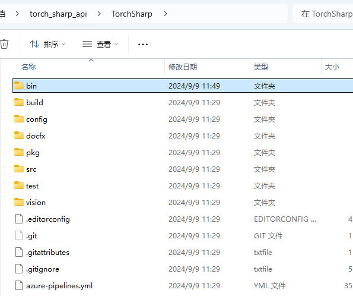
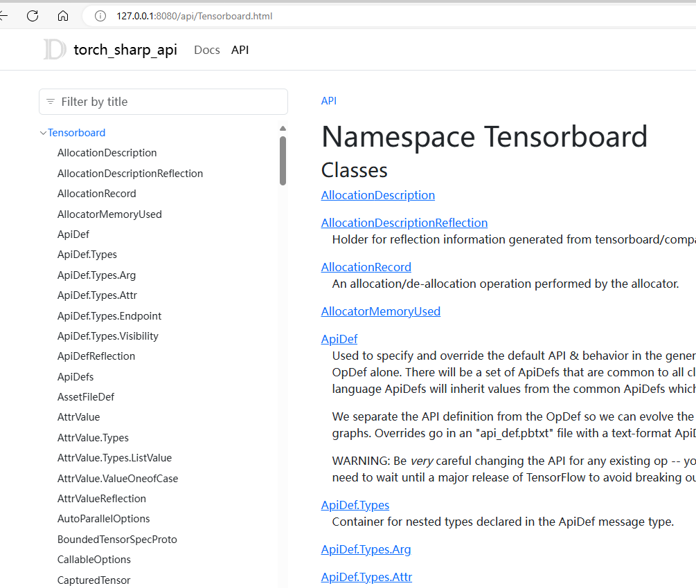

open `TorchSharp\src\TorchSharp`。

```
dotnet build
```


see:

```
├───AnyCPU.Debug
│   ├───FileRestitcher
│   │   └───netstandard2.0
│   └───TorchSharp
│       ├───net6.0
```





```
docfx ./docfx.json
```


